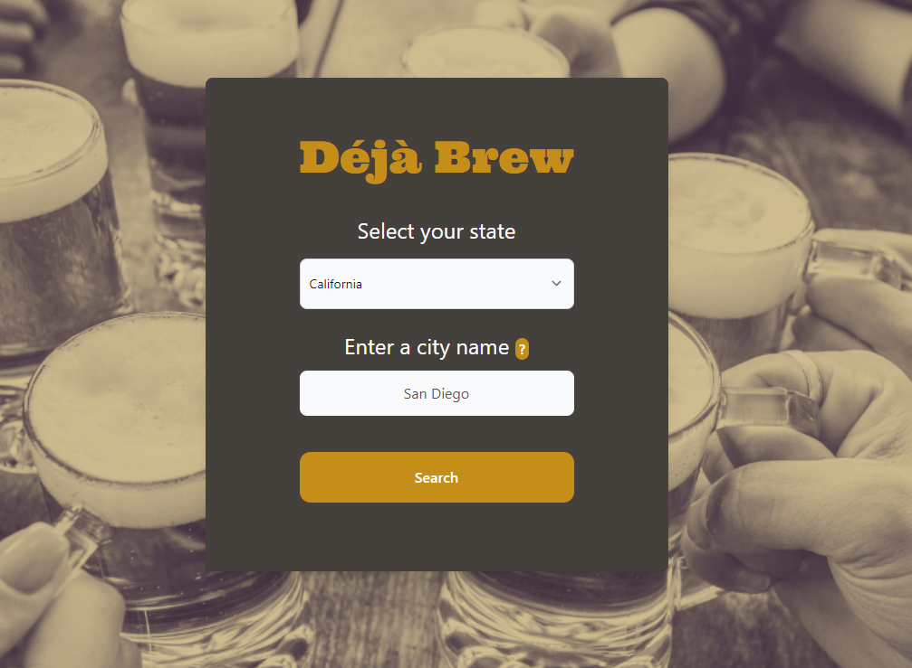
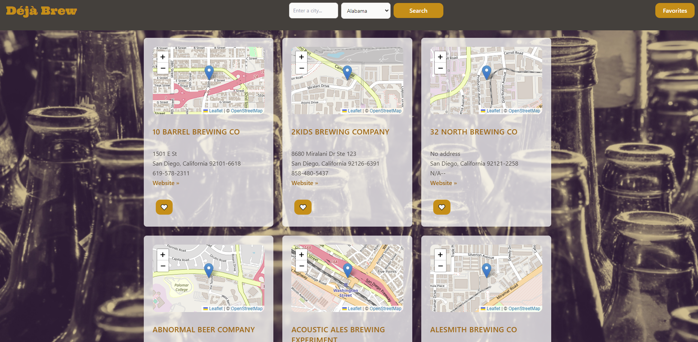

# Déjà Brew

## Description

Are you a beer enthusiast looking for a new brewery to try? Are you tired of using the same old google format and seeing ads for things you don't need? Come try out [Deja Brew](https://tiomeko.github.io/deja-brew/)!

Deja Brew is a handy application that allows users to search for breweries in local cities or anywhere in the United States. A user will select a state with the dropdown menu and type a city that is within the state selected. Once the search button is clicked, the following page will be populated with the breweries in the city.

We utilize [Leaflet](https://leafletjs.com/) to display a map for convenience and if the local brewery does not have their longitude and latitude listed in the API, it will be excluded from the list of breweries. It also uses the CSS framework [Tailwind](https://tailwindcss.com/) and pulls information from [Open Brewery DB](https://www.openbrewerydb.org/).

## Website Showcase

### <ins>[Deja Brew](https://tiomeko.github.io/deja-brew/)</ins>

 

## Technologies Used

- APIs
  - [Leaflet](https://leafletjs.com/)
  - [Open Brewery DB](https://www.openbrewerydb.org/)
- CSS Framework
  - [Tailwind CSS](https://tailwindcss.com/)
- Other
  - [Flowbite](https://flowbite.com/)
  - [Google Fonts](https://fonts.google.com/)
  - [Wickedblocks](https://wickedblocks.dev/)
  
## Contributors

  * Carson Adair :  [ Carsonadair](https://github.com/carsonadair)
  * Katherine Karr :  [Kkarrwrites](https://github.com/kkarrwrites)
  * Bethany Simmonds :  [Bsimmonds28](https://github.com/bsimmonds28)
  * Michael Arasimowicz :  [TioMeko](https://github.com/TioMeko)
